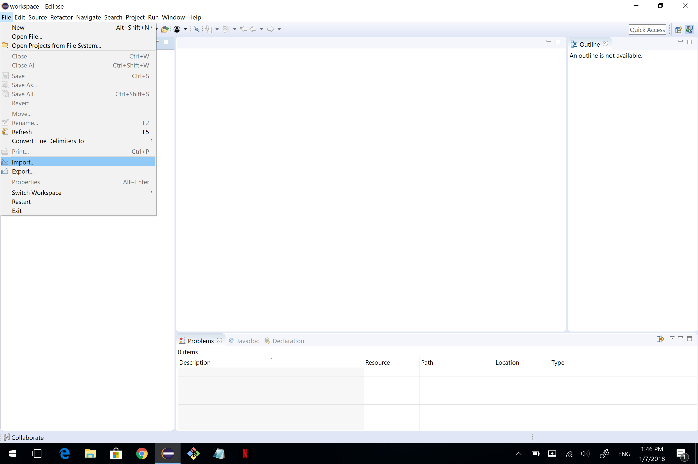
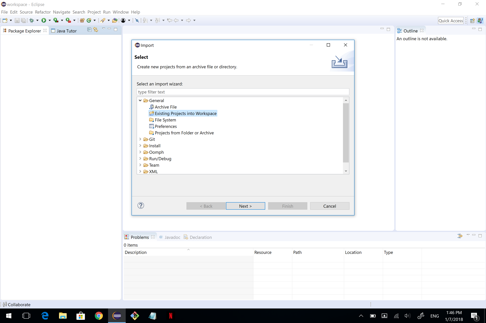
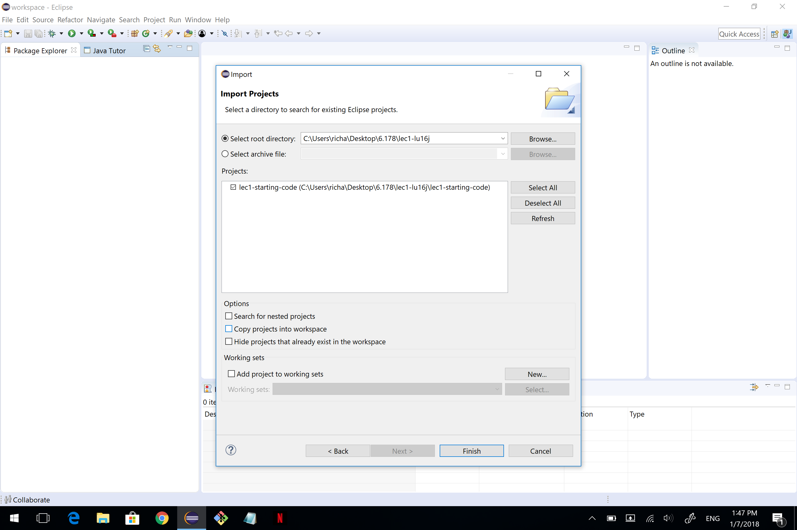
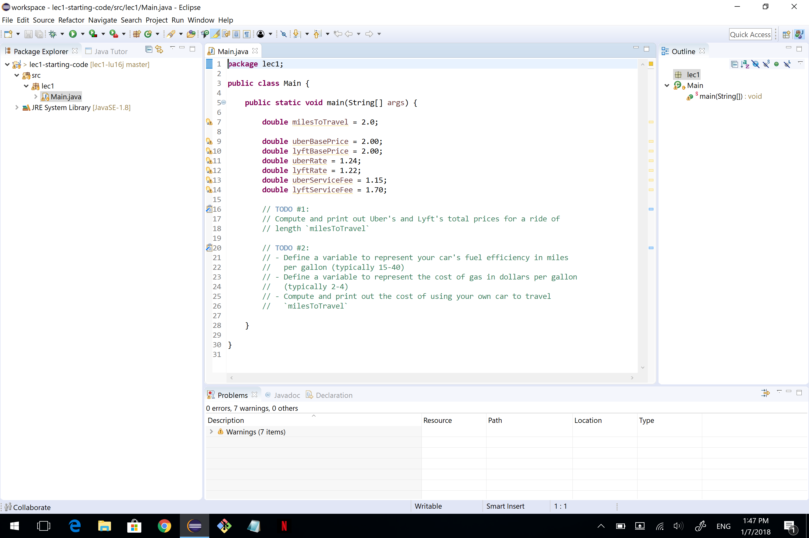

# 6.178 Lecture 2
:fire: :fire: Variables, Methods, Strings, Enums, and Arrays :fire: :fire:

### Announcements
* Join the [Piazza](https://piazza.com/class/jqj7wr4d25v501) (if you haven't already)
* Reminder: OH are `TH 11am - 4pm` in 34-303

### To Clone this Repo
* Open Terminal or Git Bash.
* Go to the directory where you keep 6.178 stuff (this is where the repository will go)
* Run: `git clone [my repo w/ SSH]`
  * If that doesn't work, try: `git clone [my repo w/ HTTPS]`
* After you have successfully cloned this repo, import lec02 into Eclipse ([instructions](#how-to-import-a-repository-into-eclipse))

### Last Time
* Set up Java + Eclipse
* Set up Git
* Java basics
* [Link](https://github.com/jchoi5me/lec01) to Lecture 1 ([alternate link](https://github.mit.edu/6178-2019/lec01))

### Today
* [Java Methods](#java-methods)
* [Writing specifications (code documentation)](#writing-specifications)
* [More about variables](#more-about-variables)
  * [Primitive Types](#primitive-types)
  * [Object Types](#object-types)
    * [Operations on Objects](#operations-on-objects)
    * [Comparisons: `==` vs `.equals()`](#comparisons--vs-equals)
    * [null](#null)
  * [`final` Keyword](#final)
  * [`static` Keyword](#static)
    * [Variable Scope](#variable-scope)
* [Arrays](#arrays)
* [Enums](#enums)

## Java Methods
Methods are similar to functions in Python. They are attached to classes (which is why we call them methods and not functions). For example, here is a method named `fahreneitToCelsius`:
```java
public class UnitConverter {

  // ... other variables and methods ...
  
  public static double fahrenheitToCelsius(double temperatureFahrenheit) {
    double ratio = 5.0 / 9.0;
    double offset = 32.0;
    return (temperatureFahrenheit - offset) * ratio;
  }

  // ... other variables and methods ...
  
}
```
A method is composed of 5 parts (in order): the modifiers, return type, method name, parameters, and the method body. (There is a 6th part, the exceptions list, which we won't talk about in this lecture.)

For the above example method:
* __modifier__ - `public`, `static`
  * `public` means the method is visible not just within this class, but to other classes in your program as well.
    * To prevent other classes from calling this method, we can make this `private`.
  * `static` means the method exists independently of any _instance_ of the class - more on that in future lectures. For now, think of it as a method that you can call directly from the `main` method.
* __return type__ - `double`
  * This means that this method returns a value of type `double`.
* __method name__ - `fahrenheitToCelsius`
  * The name of the method.
* __parameters__ - `(double temperatureFahrenheit)`
  * This method only has one parameter, but you can have multiple parameters separated by commas.
  * Parameters are declared with types, similar to variables: `<parameterType> <parameterName>`
* __method body__ - code between the curly braces
  * This code will be executed if the method is called.

To call this method from within the same class, just write the method name and provide the parameters necessary. Here we're storing the result of calling `fahrenheitToCelsius` with the parameter `temperatureFahrenheit` set to `32.0` in a `double` named `temperatureCelsius`:
```java
double temperatureCelsius = fahrenheitToCelsius(32.0); // 0.0
```

Now let's look back at the special `main` function:
```java
public class Main {

  // ... other variables and methods ...
  
  public static void main(String[] args) {
  }

  // ... other variables and methods ...
  
}
```
* __modifier__ - `public`, `static` (visible to other classes, independent of instance)
* __return type__ - `void` (special return type representing nothing returned)
* __method name__ - `main`
* __parameters__ - `(String[] args)` (a String array)
* __method body__ - the code to execute when the program runs

### Exercise: Write a method
Complete __TODO #1__ in `Main.java`.
* Create a method called `estimateRidePrice` in the same class, and allow it to take all the parameters necessary to calculate the estimated price for a ride from either Uber or Lyft.
* Modify the code in `main` to call that method instead of performing the calculations.

## Writing Specifications
A method's __specification (or specs)__ is a set of comments attached to the method that tells the user of the program everything they need to know about the method. Specs are important for software engineers because they allow us to understand and use other people's programs _without reading the actual code_.

The job of a specification is to describe the output of the method given the inputs. If the inputs satisfy the requirements outlined in the spec, then the method will produce an output that satisfies the requirements outlined in the spec.

An example spec for the `fahrenheitToCelsius` method.
```java
/**
 * Converts the temperature in Fahrenheit to the temperature in Celsius
 * @param temperatureFahrenheit the temperature in Fahrenheit
 * @return the temperature in Celsius
 */
public static double fahrenheitToCelsius(double temperatureFahrenheit) {
  ...
}
```
The first line of the spec details what the method does in plain English. Each parameter, along with any constraints, is described in a `@param`. The return value, along with any constraints, is described in the `@return`.

### Exercise: Write a spec
Write a spec, formatted as above, for your `estimateRidePrice` method.

## More about Variables
Recall from [Lecture 1](https://github.com/jchoi5me/lec01#types) ([alternate link](https://github.mit.edu/6178-2019/lec01)) that variables in Java are _statically typed_, meaning the declaration must include the type of the variable.
```java
int myAge = 23;
```

### Primitive Types
Java has a set of _primitive_ types which represent very simple data. These types are lowercased. The ones that we will deal with the most:
* `boolean` (true or false)
* `char` (single character)
* `int` (integer within ± 2^31)
* `double` (floating-point numbers)
* [a complete list](https://docs.oracle.com/javase/tutorial/java/nutsandbolts/datatypes.html)

You can think of primitive types as having __direct representation__ in the computer's memory. When you operate on a variable of type `int`, the data that gets shuttled around your computer's circuitry is the literal binary representation of that integer.

### Object Types
Java also has more complex types called _objects_. These types are typically uppercased. Any type which is not a primitive is an object. The simplest examples:
* [Strings](https://docs.oracle.com/javase/10/docs/api/java/lang/String.html) (sequences of characters, like "Hello there")
* [Arrays](https://docs.oracle.com/javase/tutorial/java/nutsandbolts/arrays.html) (sequences of values of any type; more in a bit)
* [Enums](https://docs.oracle.com/javase/tutorial/java/javaOO/enum.html) (a finite set of named values; more in a bit)

Unlike primitives, which are represented as literal values in memory, variables of object types are represented as __references__ to the location of their actual data. This data has a potentially complex structure and usually takes up more space.

#### Operations on Objects
A major, practical difference between primitives and objects is that objects (defined as classes - more in future lectures) can define their own operations, accessed via `theObject.theOperation(parameters)`. For example, String has a `.length()` operation which allows you to count its number of characters. Primitives have no operations of their own - they are all pre-defined by the Java language itself (`+`, `%`).
```java
String myName = "Richard";
int charactersInName = myName.length(); // 7
char thirdCharacterInName = myName.charAt(2); // 'c'
int indexOfH = myName.indexOf('h'); // 3
```

#### Comparisons: `==` vs `.equals()`
Sometimes we want to check whether two variables have the same value. For primitives, we use `==`; for objects, we use `.equals()`.
```java
int a, b;
boolean aEqualsB = a == b;
String c, d;
boolean cEqualsD = c.equals(d);
```

#### `null`
One unfortunate side effect of representing object types as references is that the reference can point to nothing - or `null`. You can't call operations on a variable whose value is `null`, since there is no object there.
```java
String myName = null;
int charactersInName = myName.length(); // Not allowed, will throw an error
```

### `final`
Variable declarations can have additional keywords attached to them. `final` is one such keyword, which means that the variable can only be assigned once. This is useful for defining constants whose values should never change.
```java
final int myAge = 21;
...
myAge = 22; // Not allowed, won't compile
```

### `static`
So far, we've dealt with variables defined within methods. We can also define variables within _classes_, outside of any method.
```java
public class Main {
    private static int counter = 0;
    
    public static int count() {
        counter++;
        return counter;
    }
}
```

The `counter` variable is visible to any method within the `Main` class. The `private` modifier means it cannot be accessed by other classes. Removing the `static` modifier would make it an _instance_ variable, which we will discuss in a future class.

#### Variable Scope
Generally, variables can be accessed anywhere within the _closest enclosing set of curly braces {}_.
* Variables declared in a method can only be accessed within the method.
* Variables declared in a class can be accessed within the class.
  * `public` class variables _can_ be accessed by other classes.
  * `private` class variables _cannot_ be accessed by other classes.
  * `static` vs. non-`static` has different semantics (future class).

## Arrays
Arrays represent fixed-size sequences of values. You can create arrays of any type, and they can be multidimensional:
```java
String[] months; // 1d String array
int[][] coordinates; // 2d int array
```

Since arrays are fixed-size, you have to declare its size when you assign its initial value. The size can be obtained by `.length`.
```java
String[] months = new String[12];
char[] mit = new char[] {'I', 'H', 'T', 'F', 'P'};
int numberOfMonths = months.length; // 12
int mitLength = mit.length;         // 5
```

You can obtain and assign values at specific indices in an array:
```java
char middleChar = mit[2]; // 'T'
mit[3] = 'P';             // mit is now IHTPP
```

In a future lecture, we will explore additional types in Java which can represent dynamically-sized sequences.

### Exercise: Create an Array
Complete __TODO #2__: create an array of type `String` called `months` with size 12. Populate each element of the array with the name of the month as a `String`.

#### A note on Aliasing
What does this do?
```java
int[] piDigits = new int[] {3, 1, 4, 1, 5, 9};
int[] myDigits = piDigits;
myDigits[3] = 7;
// What is the value of myDigits? What is the value of piDigits?
```
## Enums
Enum is a special data type that allows a variable to take on one of a predefined set of values. Each of these values is named, and is typically ALL_UPPERCASE.

An enum representing Direction:
```java
public enum Direction {
    NORTH, EAST, SOUTH, WEST
}
```

To declare a variable of type Direction:
```java
Direction direction = Direction.NORTH;
```

### Exercise: Create an Enum
Create an enum called `Day`, whose values are the days of the week. In Eclipse, select _File > New > Enum_. Make sure the package says `lec02`.

### Conditional Statements with Enums
Enums are useful for conditional statements. We can execute different instructions in our programs depending on the value of an enum.

#### If-Else with Enums
Recall from [Lecture 1](https://github.com/jchoi5me/lec01#if-else) the syntax for writing conditional statements.

#### What are switch statements?
TODO: write intro to switch statements

```java
Direction direction;
switch (direction) {
  case NORTH:
    System.out.println("You're heading north");
    break;
  case SOUTH:
    System.out.println("You're heading south");
    break;
  case EAST:
    System.out.println("You're heading east");
    break;
  case WEST:
    System.out.println("You're heading west");
    break;
  default:
    System.out.println("Unknown direction");
    break;
}
```

## Helpful Instructions

### How to import a repository into Eclipse
Go to _File > Import_.



Select _Existing Projects into Workspace_ under _General_. Then select Next.


Click on Browse and find the folder of the GitHub repo. The folder should be wherever you cloned the repo. Make sure `lec1-starting-code` is checkmarked and click Finish.


This is what Eclipse should look like for you after you successfully import the repo. The left panel is your __Package Explorer__. Here you can find all your packages (how Java organizes each program). Each package represents a different program in your workspace. The right panel is your __Outline__. The Outline tells you what methods, variables, etc. are in each file; you can quickly jump to them when you click on them. The bottom panel will be helpful for debugging as it has the __Console__. The center area is where you will be viewing files.
